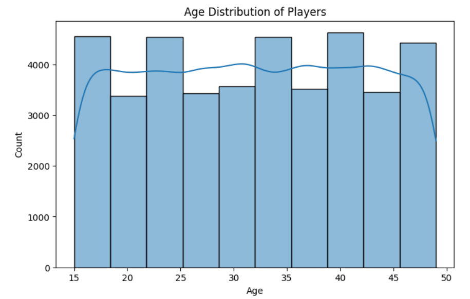
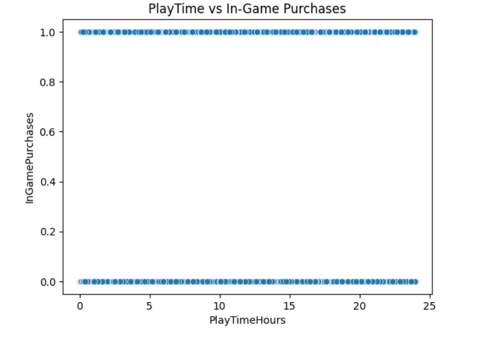

# 🎮 Online Game Behavior Analysis

Analyze online player behavior to uncover engagement patterns, spending trends, and actionable insights using Python and data visualization techniques.

---

## 📌 Project Overview

This project focuses on analyzing online gaming behavior data to understand how players interact with games, how engagement varies across demographics, and what factors influence in-game spending.  
The insights generated can help **game developers and product teams** improve player retention, monetization strategies, and overall user experience.

---

## 📂 Dataset Description

The dataset contains player-level behavioral and demographic data collected from an online gaming platform.

### 📑 Dataset Columns

| Column Name | Description |
|------------|------------|
| PlayerID | Unique identifier for each player |
| Age | Age of the player |
| Gender | Player gender |
| Location | Player location |
| GameGenre | Type of game played |
| PlayTimeHours | Total hours spent playing |
| InGamePurchases | Amount spent on in-game purchases |
| GameDifficulty | Difficulty level of the game |
| SessionsPerWeek | Average number of sessions per week |
| AvgSessionDurationMinutes | Average session duration |
| PlayerLevel | Current player level |
| AchievementsUnlocked | Number of achievements unlocked |
| EngagementLevel | Player engagement category (Low / Medium / High) |

📌 **Note:** The dataset is used for educational and analytical purposes.

---

## 🎯 Project Objectives

- Identify player demographics and behavioral trends  
- Analyze relationships between playtime, purchases, and achievements  
- Segment players based on engagement and spending behavior  
- Provide actionable, data-driven recommendations for game developers  

---

## 🛠 Tools & Technologies

- **Programming Language:** Python  
- **Libraries:** Pandas, NumPy, Matplotlib, Seaborn  
- **Environment:** Jupyter Notebook  
- **Version Control:** Git & GitHub  

---

## 🔍 Analysis Workflow

1. **Data Cleaning & Preprocessing**
   - Handling missing values
   - Data type corrections
   - Feature understanding

2. **Exploratory Data Analysis (EDA)**
   - Descriptive statistics
   - Distribution analysis
   - Player demographic insights

3. **Correlation & Trend Analysis**
   - Playtime vs In-game purchases
   - Engagement vs achievements
   - Session behavior patterns

4. **Player Segmentation**
   - Engagement-based segmentation
   - Spending behavior analysis

5. **Business Recommendations**
   - Engagement improvement strategies
   - Monetization insights

---

## 📊 Key Visual Insights

### 🧑 Player Age Distribution


### 🎯 Engagement Level Breakdown


### 💰 Playtime vs In-Game Purchases


### 🏆 Achievements vs Engagement


📌 *All visualizations were created using Matplotlib and Seaborn.*

---

## 📈 Key Insights & Findings

- Highly engaged players tend to spend more on in-game purchases  
- Players with longer session durations unlock more achievements  
- Certain game genres show higher engagement and monetization potential  
- Low-engagement players can be targeted with onboarding improvements  

---

## 💡 Recommendations for Game Developers

- Introduce personalized offers for high-engagement players  
- Improve tutorials and early rewards for low-engagement users  
- Design difficulty progression based on player behavior patterns  
- Focus marketing strategies on high-performing game genres  

---

## ▶️ How to Use This Project

1. Clone the repository:
   ```bash
   git clone https://github.com/sachini86/Online-Game-Behavior-Analysis.git

